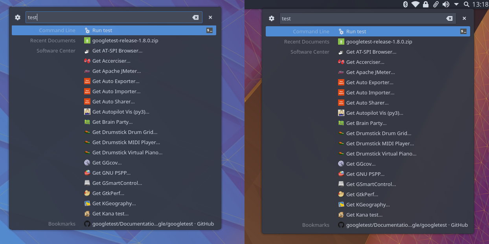

# KRunner Plasmoid
Sick of krunner appearing in the middle of your plasma desktop? Use it as a Plasmoid and put it on your desktop or in your taskbar.

<i>Note: KRunner Plasmoid's compact representation can be open with the global shortcut CTRL+Space</i>



## Tested on 
Ubuntu 16.04 with
- Plasma 5.12.4
- KDE Frameworks 5.45.0
- Qt 5.10.0

## Requirements
Build:
- libkf5config-dev >= 5.45.0
- libkf5globalaccel-dev >= 5.45.0
- libkf5i18n-dev >= 5.45.0
- libkf5package-dev >= 5.45.0
- libkf5plasma-dev >= 5.45.0
- Qt >= 5.10

Runtime:
- milou >= 5.12.5

## Build & Install
Run these instructions to build and install the plasmoid.
```
mkdir build
cd build
cmake -DCMAKE_BUILD_TYPE=Release -DKDE_INSTALL_LIBDIR=lib -DKDE_INSTALL_USE_QT_SYS_PATHS=ON -Dgtest_disable_pthreads=ON  ..
make
make install
```
## Test
Tests can be run after build from inside the build directory using:
```
make && make test
```

If the plasmoid is installed it can also be run using the plasmoidviewer before adding it to the desktop.
```
plasmoidviewer --applet /usr/local/share/plasma/plasmoids/dscheffer.krunnerplasmoid
```